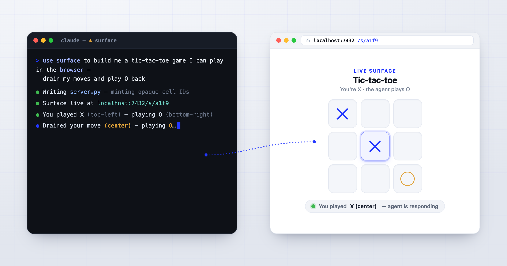
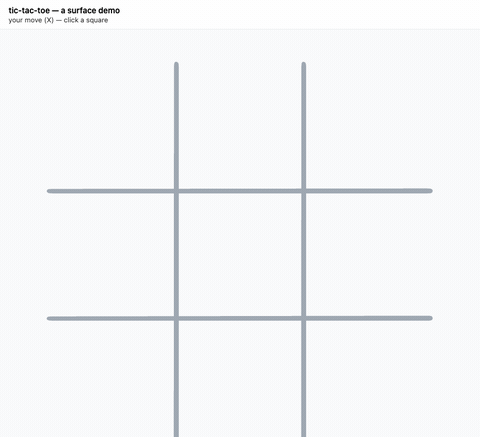

# surface

Chat is a narrow channel: a column of text, with no real way to lay out a comparison, drag a list into order, mark up an image, or hand back a dense table you can act on row by row. `surface` is your agent's escape hatch — it builds a web page shaped to the task at hand, hands you a link, and reacts to whatever you do on it. The page can be as plain as a single approval button or as rich as a drag-to-rank board, an annotated floor plan, or a refereed two-player game; either way it's built for one task and thrown away when that task is done — no app to stand up, no form to maintain.



More precisely: `surface` is a **pattern + skill** for an agent to generate an ephemeral, structured UI at a URL, deliver that URL through any channel it has, and **drain submissions autonomously** — reacting on its own, without you coming back to chat to say "I clicked it." The agent decides what every control on the page means, so submissions arrive in a known shape. It's also a strong way to *show* you information — tables, grouped lists, flagged rows — that a wall of chat text can't.

## Quick start

You don't run surface; you install the skill, then ask your agent. In **Claude Code**:

```text
/plugin marketplace add aac/surface
/plugin install surface@surface
```

(On Codex, or to install by hand, see [Installing](#installing) below.) Then ask your agent to build the canonical demo:

```text
Use the surface skill to build me a tic-tac-toe game I can play in my browser:
I'll click squares to play X, and you drain each of my moves off the wire and
play O back onto the same board, until someone wins.
```

Soon you have a browser tab with a real board: your clicks land as X, and O appears a second or two later — played by your agent, drawn onto the *same* surface. (The first build takes a little longer — the agent is writing the server — but once it's up, your moves come back live.) That one prompt exercises the whole pattern.



**Prerequisites:** none beyond the skill. For a local browser demo the agent writes and runs whatever small server it needs — you don't pre-install Go, Node, or Python (the reference servers in this repo are there to *read*, not to install). The local demo runs on loopback and needs no setup. One caveat: the tic-tac-toe board pulls its drawing library (tldraw) from a CDN, so that browser tab needs internet.

## More to ask for

Same pattern, wildly different shapes — each is a single ask:

- "Show me these 8 thumbnails and let me click the one to ship."
- "Give me a drag-to-rank surface for these 10 priorities, then tell me the order I chose."
- "Render these 30 flagged transactions as a table with approve / reject per row, and act on my picks."
- "Build an approval gate for this deploy, text me the link, and proceed only once I approve."

The agent shapes the UI to the task and throws it away when the task is done.

## How it works (the pattern in 60 seconds)

A handful of terms recur — here's the whole vocabulary:

- **Surface** — the throwaway page itself, living at a URL.
- **Affordance** — a control on the surface (a button, a cell, an upload field). Each carries an **opaque ID** the agent mints; the agent keeps a private map from ID → what that control *means*, so a submission can't be twisted into meaning something it shouldn't.
- **Drain** — the agent consuming submissions as they arrive and reacting on its own. This is the non-negotiable part: a surface you have to return to chat to act on has failed the pattern.
- **Substrate / the wire** — *how* the surface is served and submissions travel: a local HTTP server, a hosted Cloudflare Worker, a Slack message, raw sockets. The pattern is fixed; the substrate is a choice.
- **The pattern** — five invariants every implementation preserves: mint opaque IDs, persist the ID→intent map, render the surface, drain autonomously, stay ephemeral. It's the contract; everything else is illustration. Full statement in `skills/surface/references/pattern.md`.

## Why surface (and why not a form)

Agents already have three ways to collect structured input, each with a gap: a **chat reply** (unstructured, and only if the user is in chat), an **inline chat-client widget** (structured, but trapped inside a supported chat surface), or a **purpose-built app or form** (full UI, but real build-and-maintain cost). surface fills the space between them — task-shaped UI the agent generates for the moment and discards.

The honest objection is "isn't this just a web form?" The answer is no, and the reason is the shift in *who builds it and how disposable it is*:

- **The cost of bespoke collapsed to the cost of asking.** A form builder gives you fixed fields and one respondent. surface lets an agent generate a UI *shaped to the task* — a drag-to-rank, a floor-plan annotator, a refereed two-player game, a flagged-transactions review with per-row decisions — in the time it takes to describe it, then throw it away. When making a custom interactive surface gets that cheap, the calculus flips: interactions that were never worth building a UI for (too one-off, too oddly-shaped, too ephemeral) become worth a surface, because nobody has to build and own anything.
- **The URL carries the whole interaction.** Because the response surface lives at the URL, *any* outbound channel — email, SMS, push, a paging system — becomes a reply path, not just a notification. That reframes "the user isn't in chat" from a dead end into a delivery choice.
- **Reactions are code, so monitoring is cheap.** The agent encodes the drain-and-react logic and lets it run; it only re-engages for submissions that genuinely need judgment. Watching a live surface is not an LLM-call-per-interaction tax — the mechanical reactions cost nothing once written.
- **Ephemeral by default.** Today surface aims at the moment, not forever: it fills the gap *below* the threshold where standing up and maintaining a durable tool makes sense, and for durable, recurring needs a real app or form tool is still the right call.

## Installing

Installing the plugin is the canonical path. surface ships only the skill (no binary, no MCP server), and it's built for **Claude Code** and **Codex**:

- **Claude Code:** `/plugin marketplace add aac/surface`, then `/plugin install surface@surface`. The skill auto-loads from `skills/surface/`.
- **Codex:** clone the repo and symlink the skill — `ln -s "$PWD/skills/surface" ~/.codex/skills/surface` — or point your agent at this repo and let it install. (A first-class Codex plugin-marketplace path is on the way once the CLI's plugin flow settles.)
- **No plugin manager?** Point your agent at this repo (`github.com/aac/surface`) and let it install whatever way fits — the skill bundle is harness-neutral under `skills/surface/`, and there's an `install.sh` that symlinks it for you.

Each harness loads `skills/surface/SKILL.md` and the references and examples it points to. Cowork, the Claude Desktop app, and claude.ai aren't supported hosts yet — that's a planned addition, not a requirement for anything above.

## Setup

The first time you use surface interactively, the agent runs a quick setup pass: it surveys what your environment can do — local loopback, any tunnel CLIs, any hosted substrate you've configured — and records the findings, plus *where* the credentials for non-local delivery live (the locations, not the secrets), to `~/.surface/environment.md`. This is a discovery step the skill defines (`SKILL.md` §7), not a command you run. Later sessions read that file instead of re-probing, and an agent running autonomously (cron, a scheduled job) reads it instead of asking you.

For a local browser demo you need none of this — loopback works out of the box, so "ask the agent for a tic-tac-toe game" just works. Setup earns its keep the moment you want surface to deliver a URL through another channel (email, SMS, a hosted endpoint): that's what the environment file is for.

## Not in scope (yet)

surface deliberately ships narrow and grows on real-use signal. Currently out of scope:

- **A bundled/installable server binary.** v0 is skill-only — the reference servers in `skills/surface/examples/` exist to be read and re-implemented, not installed. A canonical `surface-serve` is a v1 question.
- **Templating / surface-authoring helpers.** The agent writes the HTML/JS directly; a helper layer waits on friction signal.
- **Substantive prompt-injection mitigation patterns.** `references/security.md` names the caution; deeper sanitization guidance accrues as real untrusted-input use does.
- **Persistent surfaces, link expiration, one-time-use semantics.** Surfaces are ephemeral; agents handle lifetime in their own state if they need it.

(Hosted deployment and a push/WebSocket transport are valid substrates too — the pattern (`references/pattern.md`) and SKILL.md §8 describe them, and `references/security.md` covers hosted deployment posture and the provisioning gate. They ship as *contracts to build against*, not runnable servers: unlike the local wire's committed `examples/server.go`, the hosted and WebSocket substrates have no reference implementation in the tree — the agent builds one for its environment from the pattern.)

## Composes with

surface depends on nothing else and knows about no other tool — but two sibling tools compose with it naturally, and an agent that has them gets more leverage:

- **`ask`** — an agent-to-human request inbox. A surface is a good way to *present* the thing an ask is about (a decision laid out as a board, a batch to review), while the ask itself is the durable record that a human action is pending. Surfaces are ephemeral; an ask survives the session.
- **`reach`** — delivers a payload through whatever channel a recipient prefers (SMS, email, push). When a surface's URL needs to travel to someone who isn't in chat, reach is the natural way to send it.

Neither is required; surface works standalone. The composition lives in the agent's hands, not in surface's code.

## What's in this repo

**Shipped as the skill** (loaded at runtime, all under `skills/surface/`):

| Path | Purpose |
|---|---|
| `skills/surface/SKILL.md` | Skill entry point — what surface is, when to use it, links into the references. |
| `skills/surface/references/pattern.md` | The substrate-agnostic pattern. The contract every implementation must preserve. |
| `skills/surface/references/wire-example.md` | One concrete wire (HTTP + JSON over localhost). Illustrative, not normative. |
| `skills/surface/references/lifecycle.md` | The mechanism space for autonomous draining (Monitor, polling, fs watch, push webhook). |
| `skills/surface/references/security.md` | Trust boundary, deployment posture, free-field content as injection vector. CSRF + URL-unguessability notes for non-loopback deployments. |
| `skills/surface/examples/server.go` | Go reference server implementing the wire example. Supports either stdout (`SUBMIT` lines) or filesystem-drop drain via `--drain-mode={stdout,fs}`. Read it for orientation, re-implement in whatever fits. |
| `skills/surface/examples/server_test.go` | Tests for the Go reference. |
| `skills/surface/examples/server.py` | Python stdlib reference, independently derived from the references (not Go-mirrored). Diverges from the Go sibling on operational details (port 8000, no parent-death watchdog, hard 32 MiB multipart cap) — same wire contract. |
| `skills/surface/examples/server.mjs`, `server.test.mjs` | Node stdlib reference (`node:http`), independently derived from the references; `node:test` suite (21 cases). |
| `skills/surface/examples/rust/` | Rust reference server (zero-dependency `std::net`), independently derived from the references. Cargo project — `cargo run` / `cargo test`. |
| `skills/surface/examples/tic-tac-toe.html`, `tic-tac-toe.md` | The showcase demo — a tldraw tic-tac-toe surface (you play, the agent drains moves and replies on the board), with the `.md` explaining how it maps onto the pattern and how to drive it by hand. |

The Python, Node, and Rust references were each built without their author reading the other siblings — derived from `skills/surface/references/` alone. The operational divergences (different ports, watchdog choices, error-status policies) are the validation: the pattern survives independent re-derivation.

**Packaging** (harness-specific plugin wrappers, not loaded as part of the skill):

| Path | Purpose |
|---|---|
| `.claude-plugin/plugin.json` | Claude plugin manifest. Makes the bundle installable as a Claude Code plugin; skills under `skills/` are auto-discovered. |
| `.codex-plugin/plugin.json` | Codex plugin manifest. Sibling to the Claude manifest with the same `skills/` pointer and lockstep `version`. Harness-neutral skill content stays under `skills/surface/`. |

**For humans** (not loaded by the skill):

| Path | Purpose |
|---|---|
| `README.md` | This file. |
| `LICENSE` | Apache 2.0. |
| `AGENTS.md` | Conventions for agents and contributors working on `surface` itself (load-bearing design principles, branch policy, halt conditions). `CLAUDE.md` is a thin shim that imports it so Claude Code auto-loads it. |
| `skills/surface/go.mod` | Go module declaration for the reference server. |

## Running surface across harnesses

The drain mechanism (how the agent learns of submissions) is harness-neutral as a *category*, but maps to different primitives:

| Category | Claude Code | Codex |
|---|---|---|
| Push-stream on subprocess stdout | `Bash(run_in_background)` + `Monitor` | Long-running `exec_command` session + `write_stdin`/output polling |
| Scheduled wake-ups for cadence | `ScheduleWakeup`, `/loop` | Heartbeat automations |
| FS drop-directory watch | `fswatch`/`inotifywait`/polling | Same — OS-level primitives are harness-neutral |
| Hosted poll | `WebFetch` / HTTP | `WebFetch` / HTTP — same |
| Tear-down | `KillShell` | Codex session/process-group teardown |

A surface that requires the user to come back to chat and say "I clicked it" has failed the pattern. Any adaptation must include a real drain path (long-running stdout polling, drop-directory polling, heartbeat-driven re-check, hosted poll, or webhook where available).

## Where the design lives

- **`skills/surface/SKILL.md`** + **`references/`** — the canonical design: the pattern, the wire example, lifecycle mechanisms, security stance. Start here to understand the shape of the thing.
- **`AGENTS.md`** — the load-bearing principles (trust the agent, pattern is the contract, autonomous draining is foundational). Read before changing anything in the skill bundle. (`CLAUDE.md` just imports this for Claude Code.)

## Privacy / telemetry

This skill has no phone-home. It emits no telemetry and collects no data. Any outbound network activity happens only through hosted-substrate references the user explicitly opts into (e.g., the Cloudflare Worker reference), and is entirely controlled by the operator.

## License

Licensed under the Apache License, Version 2.0. See [LICENSE](LICENSE) for details.
